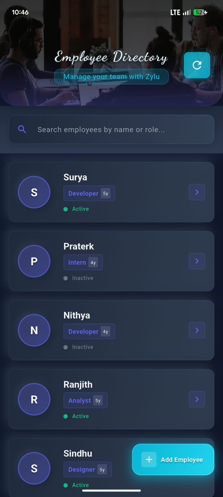

# Zylu Assessment Project 🏗️

Hey there! 👋 This is my assessment submission – a full-stack employee management system that I built with passion and a dash of tech wizardry. Hope you enjoy reviewing it as much as I enjoyed crafting it! Fingers crossed you pick this code guy for the next round. 😉

## Application Screenshots 📸

### Home Page

### App Flow Demo
<video width="50%" controls>
  <source src="app_flow.mp4" type="video/mp4">
  Your browser does not support the video tag.
</video>

*Click on the video above to see the complete app flow demonstration!*

## Backend: The Engine 🛠️

Powered by **Node.js + Express.js v5** with **MongoDB Atlas** for cloud-scaled data persistence. Mongoose ODM ensures type-safe, validated CRUD operations on employee records – because who likes buggy data?

**Key Endpoints:**
- `GET /api/employees` - Retrieve all employees
- `POST /api/employees` - Create new employee
- `GET /api/employees/:id` - Fetch specific employee
- `PUT /api/employees/:id` - Update employee details
- `DELETE /api/employees/:id` - Remove employee

**Data Model:** Employees with name, role, years of experience, and active status – all validated and timestamped. Keeps things clean and professional!

## Frontend: The Interface 📱

Crafted in **Flutter 3.8.1** with Dart, featuring a dark-themed neumorphic UI optimized for Android/iOS. Stateful widgets manage state, while HTTP integration connects to the backend API – smooth as butter.

**Core Features:**
- Employee CRUD with real-time search
- Experience badges for veterans (5+ years) – because experience matters!
- Responsive design with offline persistence
- Material Design with Google Fonts

**Architecture:** Modular structure with models, services, screens, and widgets for maintainable, scalable code. Built to last.

## Synergy: Backend ↔ Frontend 🔄

The backend serves as the data powerhouse, exposing RESTful APIs that the frontend consumes via HTTP requests. This decoupled architecture enables independent scaling, testing, and deployment – a microservices-inspired approach in a compact project. It's like peanut butter and jelly, but for code!

**Quick Start:**
1. Backend: `npm install && npm start` (ensure MongoDB Atlas connection – don't forget your keys!)
2. Frontend: `flutter pub get && flutter run` (configure API base URL in config.dart – easy peasy)

Dive into the code – where backend reliability meets frontend elegance! If you like what you see, let's chat. I'm excited to bring this energy to your team! 🚀
